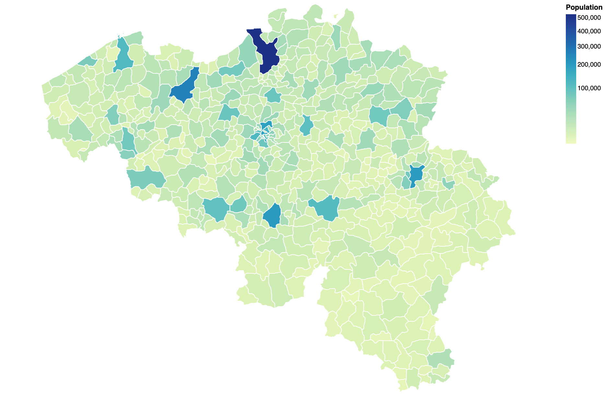

# Topojson file of Belgian municipalities, arrondissements and provinces
The repository contains a topojson file (`belgium.json`) of the Belgian municipalities, arrondissements and provinces. These objects and properties are available:

- municipalities
  - `nis`: NIS code
  - `name_nl`: name in Dutch
  - `name_fr`: name in French
  - `reg_nis`: NIS code of the region
  - `reg_nl`: region name in Dutch
  - `reg_fr`: region name in French
  - `prov_nis`: NIS code of the province
  - `prov_nl`: province name in Dutch
  - `prov_fr`: province name in French
  - `arr_nis`: NIS code of the arrondissement
  - `arr_nl`: arrondissement name in Dutch
  - `arr_fr`: arrondissement name in French
  - `population`: population on 01/01/2020
- arrondissements
  - `nis`: NIS code
  - `name_nl`: name in Dutch
  - `name_fr`: name in French
  - `reg_nis`: NIS code of the region
  - `reg_nl`: region name in Dutch
  - `reg_fr`: region name in French
  - `prov_nis`: NIS code of the province
  - `prov_nl`: province name in Dutch
  - `prov_fr`: province name in French
- provinces
  - `nis`: NIS code
  - `name_nl`: name in Dutch
  - `name_fr`: name in French
  - `reg_nis`: NIS code of the region
  - `reg_nl`: region name in Dutch
  - `reg_fr`: region name in French

## Example
The notebook at [https://observablehq.com/@bmesuere/topojson-example](https://observablehq.com/@bmesuere/topojson-example) shows an example of how to use the topojson file in combination with Vega-lite. You can load the file directly from GitHub using this URL:[https://raw.githubusercontent.com/bmesuere/belgium-topojson/master/belgium.json](https://raw.githubusercontent.com/bmesuere/belgium-topojson/master/belgium.json).

## Data sources
The base map is taken from [arneh61](https://github.com/arneh61/Belgium-Map). While the geo-part of this map is great, the properties aren't that useful. Naming of the properties is all over the place and the nis code (needed to join with other data sources) isn't present.

If you wish to modifiy the properties, you can modify the `join_data.js` script to create a new topojson file. Simply run `run.sh` to generated a new `belgium.json` file

- source topo json files: https://github.com/arneh61/Belgium-Map
- REFNIS_2019.csv (converted to urf8): https://statbel.fgov.be/nl/over-statbel/methodologie/classificaties/geografie
- bevolking_per_gemeente.csv: https://statbel.fgov.be/nl/open-data/bevolking-naar-woonplaats-nationaliteit-burgerlijke-staat-leeftijd-en-geslacht-10
