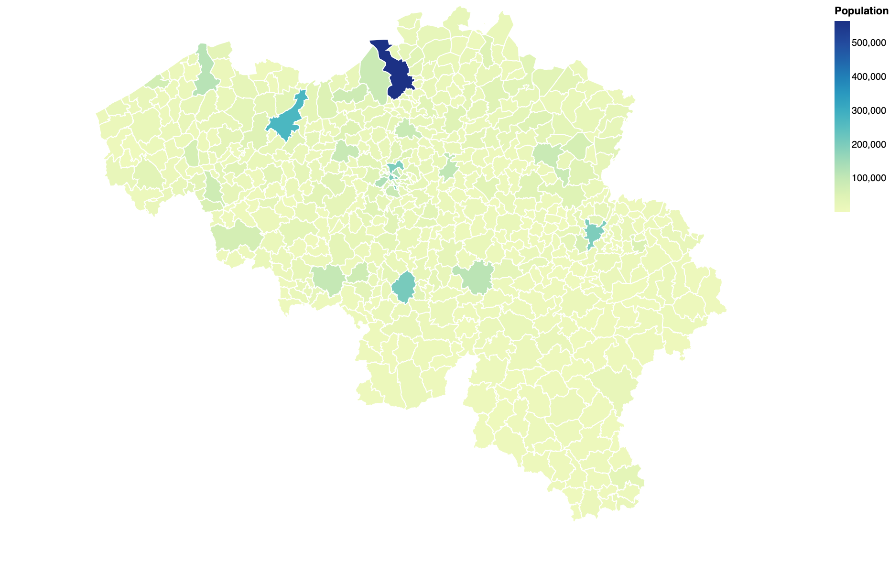

# Topojson file of Belgian municipalities, arrondissements and provinces
The repository contains a topojson file (`belgium.json`) of the Belgian municipalities, arrondissements and provinces. The boundaries reflect the administrative situation on **01/01/2025** (565 municipalities, after the 2025 municipal mergers). These objects and properties are available:

- municipalities
  - `nis`: NIS code
  - `name_nl`: name in Dutch
  - `name_fr`: name in French
  - `reg_nis`: NIS code of the region
  - `reg_nl`: region name in Dutch
  - `reg_fr`: region name in French
  - `prov_nis`: NIS code of the province (absent for the Brussels-Capital Region)
  - `prov_nl`: province name in Dutch
  - `prov_fr`: province name in French
  - `arr_nis`: NIS code of the arrondissement
  - `arr_nl`: arrondissement name in Dutch
  - `arr_fr`: arrondissement name in French
  - `population`: population on 01/01/2026
- arrondissements
  - `nis`: NIS code
  - `name_nl`: name in Dutch
  - `name_fr`: name in French
  - `reg_nis`: NIS code of the region
  - `reg_nl`: region name in Dutch
  - `reg_fr`: region name in French
  - `prov_nis`: NIS code of the province (absent for the Brussels-Capital Region)
  - `prov_nl`: province name in Dutch
  - `prov_fr`: province name in French
- provinces
  - `nis`: NIS code (the Brussels-Capital Region is included as a feature with only the region properties)
  - `name_nl`: name in Dutch
  - `name_fr`: name in French
  - `reg_nis`: NIS code of the region
  - `reg_nl`: region name in Dutch
  - `reg_fr`: region name in French

## Example
The notebook at [https://observablehq.com/@bmesuere/topojson-example](https://observablehq.com/@bmesuere/topojson-example) shows an example of how to use the topojson file in combination with Vega-lite. You can load the file directly from GitHub using this URL: [https://raw.githubusercontent.com/bmesuere/belgium-topojson/master/belgium.json](https://raw.githubusercontent.com/bmesuere/belgium-topojson/master/belgium.json).

## Older versions
The pre-2025 version of the map (581 municipalities, as they existed from 2019 through 2024, with population figures of 01/01/2020) is available at the [v2020 tag](https://github.com/bmesuere/belgium-topojson/blob/v2020/belgium.json).

## Data sources
Everything is generated from official [Statbel](https://statbel.fgov.be/) open data:

- boundaries: [statistical sectors](https://statbel.fgov.be/nl/open-data/statistische-sectoren-2025) (the ~20k sectors are dissolved into municipalities, arrondissements and provinces, so the three layers share identical topology)
- population: [population by place of residence, nationality, marital status, age and sex](https://statbel.fgov.be/nl/themas/bevolking/structuur-van-de-bevolking) (the `TF_SOC_POP_STRUCT_*` open data files)

## Regenerating the file
Run `./run.sh` to download the source data and regenerate `belgium.json`. The script uses [mapshaper](https://github.com/mbloch/mapshaper) to reproject (Belgian Lambert 72 → WGS84), dissolve, simplify and quantize the geometry, and `join_data.js` to add the population numbers. After a future round of municipal mergers, updating the two date variables at the top of `run.sh` should be all that's needed.
